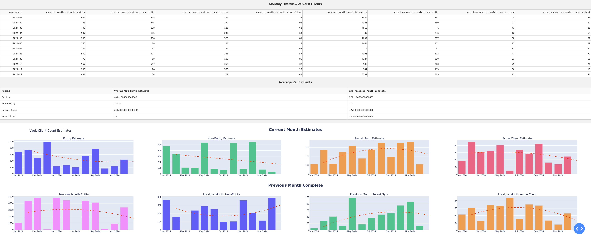

# Vault Manual License Utilisation Dashboard

The **Vault Manual License Utilisation Dashboard** is a web application built with Dash that allows users to visualize client license utilization data from a JSON data payload after generated the data bundle. Users can upload their data bundle, specify trendline parameters, and generate insights through both graphical representations and tabular data.

Note that the steps needs to generate the data bundle can be found here: [Manual license utilization reporting](https://developer.hashicorp.com/vault/docs/enterprise/license/manual-reporting)

## Features

- Upload Snapshots from data bundle for processing.
- Specify the additional number of months for trendline estimation.
- Select different polynomial degrees for trendlines.
- Display current and previous month estimates in a table format.
- Generate graphical representations of the data with optional trendlines.
- Includes an examples in case you want to generate a random payload and visualise it.

## Screenshot



## Prerequisites

Before you begin, ensure you have the following installed on your local machine:

- **Docker**: Make sure you have Docker installed. You can download it from [Docker's official website](https://www.docker.com/get-started).

## Getting Started

Follow these steps to run the web application locally using Docker:

### 1. Pull the Docker Image

First, clone this repository to your local machine:

Open your terminal or command prompt and run the following command to pull the Docker image from Docker Hub:

```bash
docker pull samuelleezy/vault-license-utilitisation-reporting:0.0.5
```

### 2. Run the Docker Container

After pulling the image, you can run the Docker container. The following command maps port 8050 of the container to port 8050 on your local machine:

```bash
docker run -d -p 8050:8050 samuelleezy/vault-license-utilitisation-reporting:0.0.5
```

### 3. Access the Web Application

Once the container is running, open your web browser and go to:

```bash
http://localhost:8050
```

### 4. Using the Dashboard

1. Drag and drop the JSON data file onto the page, and the table + graphs will automatically generate
2. Tick the checkbox to draw trendlines on the relevant graphs
3. Manipulate the trendline by specifying which degree of polynomial to use
4. Extend the polynomial to find potentially next estimate by extending the number of months

### 5. Stopping the Container

To stop the running container, first, list all running containers:

```bash
docker ps
```

Find the CONTAINER ID of the running app and stop it using:

```bash
docker stop <CONTAINER_ID>
```

### 6. Remove the Container (optional)

If you want to remove the container after stopping it, run:

```bash
docker rm <CONTAINER_ID>
```

## Troubleshooting

- If you encounter any issues, ensure that Docker is running and that no other services are using port 8050.
- Check the logs of the container for errors by running:

```bash
docker logs <CONTAINER_ID>
```

## Contributing

Feel free to submit issues or pull requests if you want to contribute to the project.

## Acknowledgement

- To Shaun Stuart for the question that led to the creation of this project
- To David Joo for the suggestions on making this more reusable for everyone
- [Dash](https://dash.plotly.com/) for providing a powerful framework to build this web application.
- [Plotly](https://plotly.com/python/) for the graphing library that makes visualizations easy.
- [Pandas](https://pandas.pydata.org/) for data manipulation and analysis.
- [ChatGPT](https://chatgpt.com/) for helping me create this webapp in a short amount of time.
